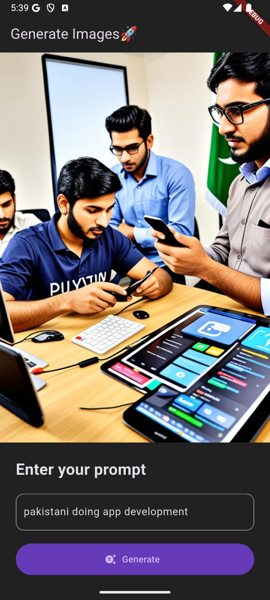

# AI Image Generator 🎨

A Flutter application that generates images using AI based on text prompts. This app provides a sleek dark-themed interface for creating stunning AI-generated artwork.

## 📱 Features

- **AI-Powered Image Generation**: Create unique images from text descriptions
- **Dark Theme UI**: Modern and elegant dark interface
- **Real-time Generation**: See your images generated in real-time
- **Cross-Platform**: Runs on Android, iOS, Web, and Desktop
- **BLoC State Management**: Robust state management using Flutter BLoC

## 🚀 Technologies Used

- **Flutter**: Cross-platform mobile development framework
- **Dart**: Programming language
- **BLoC Pattern**: State management solution
- **Dio**: HTTP client for API calls
- **Material Design**: Modern UI components

## 📱 Screenshots

<div style="display: flex; justify-content: space-around;">
  
  
</div>

## 🛠️ Installation

### Prerequisites

- Flutter SDK (>=3.7.0)
- Dart SDK
- Android Studio / VS Code
- Android/iOS device or emulator

### Steps

1. **Clone the repository**
   ```bash
   git clone https://github.com/ArslanYousaf12/mid_image_generator.git
   cd mid_image_generator
   ```

2. **Install dependencies**
   ```bash
   flutter pub get
   ```

3. **Run the app**
   ```bash
   flutter run
   ```

## 📁 Project Structure

```
lib/
├── main.dart                          # App entry point
└── feature/
    └── prompt/
        ├── bloc/
        │   ├── prompt_bloc.dart        # BLoC logic
        │   ├── prompt_event.dart       # BLoC events
        │   └── prompt_state.dart       # BLoC states
        ├── repo/
        │   └── prompt_repo.dart        # Repository for API calls
        └── ui/
            └── create_prompt_screen.dart # Main UI screen
```

## 🔧 Usage

1. **Launch the app**
2. **Enter your prompt**: Type a description of the image you want to generate
3. **Tap Generate**: Press the generate button to create your AI image
4. **View Result**: Your generated image will appear on the screen

### Example Prompts

- "A beautiful sunset over mountains"
- "A futuristic city with flying cars"
- "A cat wearing a astronaut helmet in space"
- "Abstract art with vibrant colors"

## 🏗️ Architecture

This app follows the **BLoC (Business Logic Component)** pattern:

- **UI Layer**: Handles user interactions and displays data
- **BLoC Layer**: Manages business logic and state
- **Repository Layer**: Handles data operations and API calls

## 📦 Dependencies

```yaml
dependencies:
  flutter:
    sdk: flutter
  cupertino_icons: ^1.0.8
  bloc: ^9.0.0
  flutter_bloc: ^9.1.1
  dio: ^5.9.0

dev_dependencies:
  flutter_test:
    sdk: flutter
  flutter_lints: ^5.0.0
```

## 🤝 Contributing

1. Fork the repository
2. Create your feature branch (`git checkout -b feature/AmazingFeature`)
3. Commit your changes (`git commit -m 'Add some AmazingFeature'`)
4. Push to the branch (`git push origin feature/AmazingFeature`)
5. Open a Pull Request

## 📄 License

This project is licensed under the MIT License - see the [LICENSE](LICENSE) file for details.

## 👨‍💻 Author

**Arslan Yousaf**
- GitHub: [@ArslanYousaf12](https://github.com/ArslanYousaf12)

## 🙏 Acknowledgments

- Flutter team for the amazing framework
- The open-source community for various packages used

---

⭐ **If you found this project helpful, please give it a star!** ⭐
